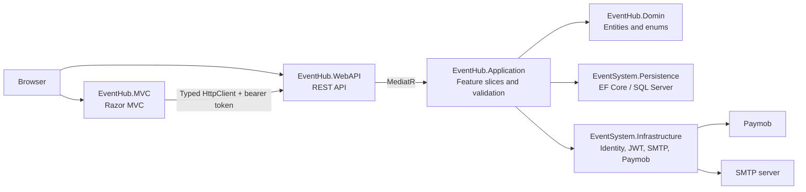
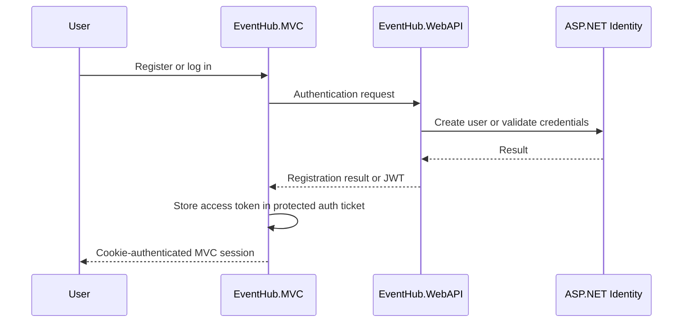
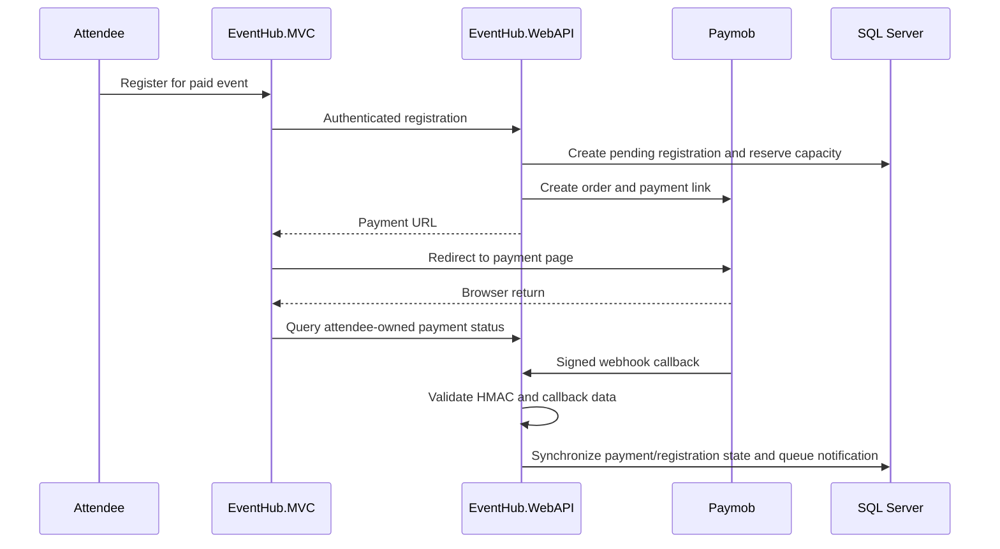
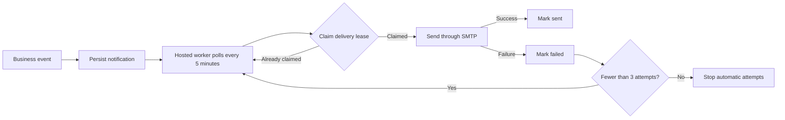

# EventHub

EventHub is a web-based event management system for attendees, organizers, and administrators. It supports online and offline events, event discovery and management, registration/cancellation, paid-event processing, email notifications, and role-based dashboards. The business scope is described in [Event Management System.pdf](docs/Event%20Management%20System.pdf); this README documents the implementation currently in this repository.

The solution has an ASP.NET Core MVC browser application and an ASP.NET Core Web API that owns business rules, authorization, persistence, payments, and notification delivery.

> **Status:** Core flows are implemented. The repository does not currently contain automated test projects, Docker artifacts, or a CI workflow. Configure real infrastructure and review the production considerations before any production deployment.

## Table of contents

- [Capabilities](#capabilities)
- [Roles and permissions](#roles-and-permissions)
- [Architecture](#architecture)
- [Technology stack](#technology-stack)
- [Repository structure](#repository-structure)
- [Local setup](#local-setup)
- [Configuration](#configuration)
- [API documentation](#api-documentation)
- [Core flows](#core-flows)
- [Database and persistence](#database-and-persistence)
- [Testing](#testing)
- [Deployment and production considerations](#deployment-and-production-considerations)
- [Known limitations](#known-limitations)
- [Contributing](#contributing)
- [License](#license)

## Capabilities

- **Identity and roles:** ASP.NET Core Identity registration/login, JWT bearer authentication, MVC cookie sessions, and API-enforced `Admin`, `Organizer`, and `Attendee` roles.
- **Public event browsing:** anonymous list, search, category filter, pagination, details, and availability endpoints; public responses exclude online meeting URLs.
- **Event management:** organizers manage their own events, attendees, statistics, event status, and announcements. Administrators manage users/roles, events, global registrations, categories through the API, and dashboards.
- **Registration and capacity:** attendee-owned registrations and cancellations, duplicate-registration prevention, capacity tracking, and concurrency-aware operations.
- **Free and paid events:** free registrations are confirmed immediately. Paid registrations use Paymob and remain pending until the authoritative webhook synchronizes payment state.
- **Paymob callbacks:** SHA-512 HMAC validation, payment/order validation, persisted transaction state, duplicate callback handling, and an attendee-owned payment-status endpoint for browser return pages.
- **Notifications:** persisted confirmation, payment-confirmation, update, cancellation, reminder, and announcement notifications sent through SMTP with retry, deduplication, and leasing behavior.
- **MVC and Web API:** Razor MVC pages use typed API clients and antiforgery validation; the API exposes the business feature areas listed below.

## Roles and permissions

| Role | Implemented capabilities |
|---|---|
| **Attendee** | Browse events, register, view their own registrations/payment status, cancel eligible registrations, and retrieve an eligible online meeting link. |
| **Organizer** | Access an organizer dashboard; manage only owned events; view attendees/statistics; update event status; send event announcements. |
| **Admin** | Access the admin dashboard; manage users/roles and events; view global registrations; manage categories through the API; send announcements. |

MVC route authorization is present for navigation and usability, but Web API authorization and application ownership checks are the authoritative security boundary.

## Architecture

The repository is a layered modular monolith. The Application project uses vertical feature slices, MediatR commands/queries, FluentValidation pipeline validation, AutoMapper, repository abstractions, and a unit-of-work abstraction.



### Request flow

1. MVC handles browser pages and calls the API through typed client services. Authenticated API calls receive the bearer token from the protected MVC authentication ticket.
2. API controllers map request/view models to MediatR commands and queries.
3. Application handlers validate requests and apply role, ownership, registration, payment, and notification rules.
4. Persistence implements SQL Server data access through EF Core. Infrastructure implements Identity/JWT, email, Paymob, user context, and supporting services.

## Technology stack

| Area | Verified implementation |
|---|---|
| Runtime | .NET 9 (`net9.0`) |
| Web | ASP.NET Core MVC and ASP.NET Core Web API |
| Data | Entity Framework Core 9 with SQL Server |
| Security | ASP.NET Core Identity, JWT bearer authentication, role-based authorization |
| Patterns | MediatR, CQRS-style feature slices, FluentValidation, AutoMapper, repository/unit of work |
| Email | MailKit over SMTP |
| Payments | Paymob HTTP integration and webhook processing |
| API exploration | Swagger/OpenAPI in Development |

Docker is intentionally not listed: no Dockerfile or Compose configuration exists in this repository.

## Repository structure

```text
EventHub/
├── EventHub.sln
├── EventHub.Domin/                 # Entities, enums, constants, base types
├── EventHub.Application/           # Feature slices, DTOs, validation, mappings, contracts
├── EventSystem.Infrastructure/     # Identity/JWT, SMTP, Paymob, user context
├── EventSystem.Persistence/        # DbContext, repositories, unit of work, migrations, seeding
├── EventHub.WebAPI/                # Controllers, middleware, API models, hosted services
├── EventHub.MVC/                   # Razor MVC controllers, views, models, typed API clients
└── docs/
    └── Event Management System.pdf # Business requirements source
```

Useful locations:

- [`EventHub.Application/Features`](EventHub.Application/Features) - event, registration, payment, notification, dashboard, account, category, and admin behavior.
- [`EventHub.WebAPI/Presentation/Controllers`](EventHub.WebAPI/Presentation/Controllers) - API entry points and role boundaries.
- [`EventHub.WebAPI/Presentation/HostedServices`](EventHub.WebAPI/Presentation/HostedServices) - reminder and notification dispatch scheduling.
- [`EventHub.MVC/Services`](EventHub.MVC/Services) - typed API clients and MVC authentication support.
- [`EventSystem.Persistence/Data/Migrations`](EventSystem.Persistence/Data/Migrations) - EF Core migrations.

## Local setup

### Prerequisites

- .NET 9 SDK
- SQL Server or SQL Server LocalDB
- A development SMTP server/account to exercise emails
- Paymob test/provider credentials to exercise paid-event flows
- A trusted local HTTPS development certificate for HTTPS launch profiles

### Restore and build

```powershell
dotnet restore EventHub.sln
dotnet build EventHub.sln
```

### Configure local secrets

The Web API project has a User Secrets identifier. Prefer Secret Manager for local secrets instead of committing credentials to configuration files.

```powershell
dotnet user-secrets set "ConnectionStrings:DefaultConnection" "YOUR_SQL_SERVER_CONNECTION_STRING" --project EventHub.WebAPI
dotnet user-secrets set "Jwt:Key" "YOUR_LONG_RANDOM_JWT_SIGNING_KEY" --project EventHub.WebAPI
dotnet user-secrets set "EmailSettings:Password" "YOUR_SMTP_PASSWORD" --project EventHub.WebAPI
dotnet user-secrets set "PaymobSettings:ApiKey" "YOUR_PAYMOB_API_KEY" --project EventHub.WebAPI
dotnet user-secrets set "PaymobSettings:HmacSecret" "YOUR_PAYMOB_WEBHOOK_HMAC_SECRET" --project EventHub.WebAPI
```

Set the remaining values listed in [Configuration](#configuration) through local configuration or user secrets.

### Apply migrations

The persistence project contains EF Core migrations. To apply them explicitly, use the API as the startup project:

```powershell
dotnet ef database update --project EventSystem.Persistence/EventHub.Persistence.csproj --startup-project EventHub.WebAPI/EventHub.WebAPI.csproj
```

`dotnet ef` must be installed/available in the development environment. The current API startup also invokes its database initializer and applies pending migrations; controlled explicit migration deployment is preferable outside development.

### Run the applications

Start the API:

```powershell
dotnet run --project EventHub.WebAPI/EventHub.WebAPI.csproj --launch-profile https
```

Start MVC in a second terminal:

```powershell
dotnet run --project EventHub.MVC/EventHub.MVC.csproj --launch-profile https
```

| Application | Checked-in HTTPS launch URL |
|---|---|
| MVC | `https://localhost:7240` |
| Web API | `https://localhost:7158` |
| Swagger (Development only) | `https://localhost:7158/swagger` |

If the API URL changes, update `BackendApi:BaseUrl` for MVC.

## Configuration

The following configuration sections are read by the applications. Use placeholders only; do not commit connection strings, passwords, API keys, access tokens, or webhook HMAC values.

### Web API

```json
{
  "ConnectionStrings": {
    "DefaultConnection": "YOUR_SQL_SERVER_CONNECTION_STRING"
  },
  "Jwt": {
    "Key": "YOUR_LONG_RANDOM_JWT_SIGNING_KEY",
    "Issuer": "YOUR_JWT_ISSUER",
    "Audience": "YOUR_JWT_AUDIENCE",
    "ExpiresMinutes": 30
  },
  "EmailSettings": {
    "Email": "YOUR_SMTP_SENDER_ADDRESS",
    "DisplayName": "EventHub",
    "Password": "YOUR_SMTP_PASSWORD",
    "Host": "YOUR_SMTP_HOST",
    "Port": 587
  },
  "PaymobSettings": {
    "ApiKey": "YOUR_PAYMOB_API_KEY",
    "HmacSecret": "YOUR_PAYMOB_WEBHOOK_HMAC_SECRET",
    "CardIntegrationId": "YOUR_PAYMOB_CARD_INTEGRATION_ID",
    "IframeId": "YOUR_PAYMOB_IFRAME_ID",
    "BaseUrl": "YOUR_PAYMOB_BASE_URL",
    "ReturnUrl": "https://YOUR_MVC_HOST/Registrations/PaymentReturn/{registrationId}"
  }
}
```

`PaymobSettings` is startup-validated. The return URL must be absolute HTTPS and may contain `{registrationId}`. Callback HMAC validation fails closed when the HMAC secret is missing.

The current code has no dedicated public-application URL configuration for account confirmation/password-reset links. Review and harden that flow before public production use.

### MVC

```json
{
  "BackendApi": {
    "BaseUrl": "https://YOUR_API_HOST/"
  }
}
```

For non-development environments, use environment variables, Secret Manager, or a secure secret store. Environment variables use double underscores, for example `ConnectionStrings__DefaultConnection`, `Jwt__Key`, and `PaymobSettings__HmacSecret`.

## API documentation

Swagger/OpenAPI is enabled in Development. With the default HTTPS profile, open `https://localhost:7158/swagger`.

The API is organized around:

- authentication, confirmation/reset, refresh tokens, and account profile/password operations;
- public and managed events, availability, and categories;
- attendee registrations, payment status, and meeting-link access;
- Paymob webhook processing;
- notifications/announcements;
- organizer event listings/dashboard data; and
- administrator dashboards, users/roles, registrations, and event operations.

Controllers and their request/response models are the authoritative contract. A full Postman collection is not currently included and will be added separately.

## Core flows

### Authentication



Identity requires confirmed email before login. The API exposes confirmation and reset operations; MVC currently provides a registration-complete page rather than a complete browser confirmation/reset journey.

### Free registration

```mermaid
sequenceDiagram
    participant Attendee
    participant MVC as EventHub.MVC
    participant API as EventHub.WebAPI
    participant DB as SQL Server
    participant Worker as Notification worker
    participant SMTP

    Attendee->>MVC: Register for a free event
    MVC->>API: Authenticated registration
    API->>DB: Validate role, event state, uniqueness, and capacity
    API->>DB: Confirm registration; update attendee count; queue notification
    API-->>MVC: Confirmed registration
    Worker->>DB: Claim notification
    Worker->>SMTP: Send email
    Worker->>DB: Mark sent or retryable failure
```

### Paid registration and Paymob confirmation



The signed webhook is authoritative; the browser return is not accepted as proof of payment.

### Notification delivery and retry



## Database and persistence

[`EventDbContext`](EventSystem.Persistence/Data/Contexts/EventDbContext.cs) uses EF Core with SQL Server. Migrations are in [`EventSystem.Persistence/Data/Migrations`](EventSystem.Persistence/Data/Migrations).

Persisted concepts include `ApplicationUser`, events, categories, registrations, payment transactions, notifications, and user refresh tokens. Existing integrity mechanisms include:

- unique `(UserId, EventId)` registrations;
- filtered unique Paymob order and transaction identifiers;
- row-version concurrency for payment transactions and notifications, plus optimistic event concurrency;
- foreign keys between users, events, registrations, payment transactions, and notifications; and
- soft-delete query filtering for domain entities derived from the base model.

## Testing

No automated test project is currently present. Build the solution before accepting changes:

```powershell
dotnet build EventHub.sln
```

Recommended manual/integration verification:

- registration, confirmation, login/logout, profile/password, and reset flows;
- event browse/filter/detail/availability and keyboard/mobile behavior;
- free registration, duplicate prevention, cancellation, and concurrent last-seat behavior;
- paid registration, Paymob redirect/return, valid/invalid/duplicate/late callbacks;
- notification confirmation, update, cancellation, reminder, announcement, retry, and lease behavior;
- organizer ownership boundaries and administrator user/event/registration operations.

## Deployment and production considerations

No Dockerfile, Compose file, deployment manifest, CI workflow, or health-check endpoint was found. Do not treat the checked-in configuration as production-ready.

Before deployment:

1. Use secure secret management and valid HTTPS certificates.
2. Apply/review EF Core migrations through a controlled deployment process.
3. Configure and verify SMTP delivery and Paymob production credentials, return URL, and webhook endpoint.
4. Test valid, failed, duplicate, concurrent, and late payment callbacks.
5. Add health checks, structured logging/monitoring, and alerting for terminal notification failures.
6. Review rate limiting, security headers, CORS needs, trusted account-email URL generation, and token/session revocation behavior.
7. Run end-to-end and concurrency tests before declaring a production release.

## Known limitations

- No automated unit/integration test projects, Docker artifacts, CI workflow, or Postman collection are currently present.
- Swagger is enabled only in Development.
- No dedicated `PublicAppUrl`-style configuration section exists for account email links.
- Category management is available through the Web API; an administrator MVC category-management UI is not present.
- Health checks, structured request/error telemetry, and terminal-notification-failure alerting are not represented in the repository.

## Contributing

Keep changes in the appropriate layer and preserve the existing feature-slice, MediatR, FluentValidation, repository/unit-of-work, and typed MVC API-client conventions. Restore and build the solution before submitting changes, avoid committing secrets, and verify affected role, payment, and notification paths.

## License

License: not specified.
